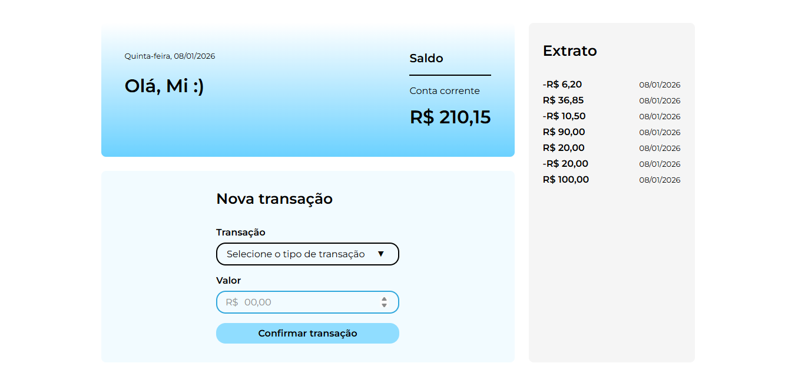

<h1 align="center"> Anybank </h1>
<h3 align="center"> Contador de finanças </h3>

<p align="center">
Projeto desenvolvido no curso Angular 19: aplicando interação entre componentes com inputs e outputs, promovido pela plataforma de ensino Alura.

<p></p>
<p align="center">
  <a href="#-tecnologias">Tecnologias</a>&nbsp;&nbsp;&nbsp;|&nbsp;&nbsp;&nbsp;
  <a href="#-projeto">Projeto</a>&nbsp;&nbsp;&nbsp;|&nbsp;&nbsp;&nbsp;
  <a href="#-layout">Layout</a>&nbsp;&nbsp;&nbsp;|&nbsp;&nbsp;&nbsp;
</p>

<p align="center">
  
</p>

<br>

## 🚀 Tecnologias

Esse projeto foi desenvolvido com as seguintes tecnologias:

- HTML e CSS
- JavaScript
- Angular
- Git e Github

## 💻 Projeto

Aplicação web desenvolvida para receber, contabilizar e exibir ações de depósito e saque, apresentando saldo e histórico de transações. Aplicado as técnicas de:

</p>
<li> Formatar dados com os Pipes do Angular, como DatePipe e CurrencyPipe. </li>
<li> Criar formulários com vínculo bidirecional (two-way binding) na abordagem de formulários orientados a template</li>
<li> Implementar a comunicação entre componentes com inputs e outputs</li>
<li>Aplicar dinamismo e reatividade com signals e computed </li>
<li> Utilizar bibliotecas externas para resolver problemas do projeto</li>

## 🔖 Layout

Você pode visualizar o layout do projeto através [DESSE LINK](figma.com/design/QXDgfZPFw7eGLn9FTakzdI/Angular-19--Inputs--Outputs-e-Content-Projection-%7C-Anybank--Community-?t=bBi0eybdE9Bq3rr3-0). É necessário ter conta no [Figma](https://figma.com) para acessá-lo.

<p align="center">
 Feito com ♥
</p>

## Anybank

This project was generated using [Angular CLI](https://github.com/angular/angular-cli) version 19.2.9.

## Development server

To start a local development server, run:

```bash
ng serve
```

Once the server is running, open your browser and navigate to `http://localhost:4200/`. The application will automatically reload whenever you modify any of the source files.

## Code scaffolding

Angular CLI includes powerful code scaffolding tools. To generate a new component, run:

```bash
ng generate component component-name
```

For a complete list of available schematics (such as `components`, `directives`, or `pipes`), run:

```bash
ng generate --help
```

## Building

To build the project run:

```bash
ng build
```

This will compile your project and store the build artifacts in the `dist/` directory. By default, the production build optimizes your application for performance and speed.

## Running unit tests

To execute unit tests with the [Karma](https://karma-runner.github.io) test runner, use the following command:

```bash
ng test
```

## Running end-to-end tests

For end-to-end (e2e) testing, run:

```bash
ng e2e
```

Angular CLI does not come with an end-to-end testing framework by default. You can choose one that suits your needs.

## Additional Resources

For more information on using the Angular CLI, including detailed command references, visit the [Angular CLI Overview and Command Reference](https://angular.dev/tools/cli) page.
